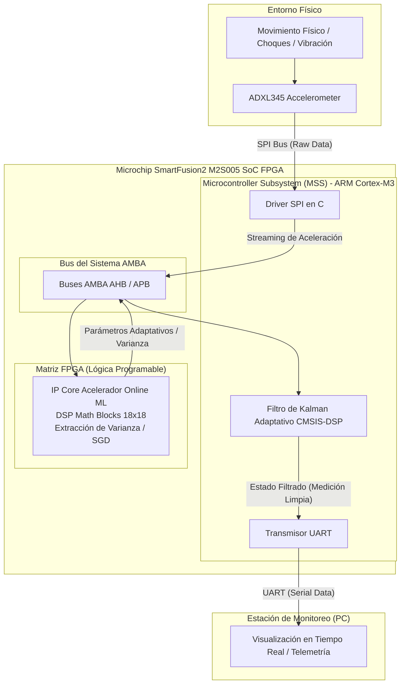

# Edge-AI and Hardware/Software Co-Design Intensive IEEE CASS UMSA Training Program 2026

[](https://edu.ieee.org/bo-umsa-cas/)
[](https://www.microchip.com/en-us/product/m2s005)
[](https://capsulaelectronicafpga.com/fpga-polaris/)
[](https://www.microchip.com/en-us/products/fpgas-and-plds/fpga-and-soc-design-tools/fpga/libero-software-later-versions)

---

## Descripción General

Este proyecto implementa una arquitectura embebida heterogénea de **Co-Diseño Hardware/Software** orientada a **Edge-AI** y procesamiento de señales en tiempo real sobre la tarjeta de desarrollo **Polaris** (SoC FPGA Microchip SmartFusion2 `M2S005`).

El objetivo principal es resolver el problema de filtrado y estimación de estado ante perturbaciones no estacionarias y choques mecánicos severos. A diferencia de un Filtro de Kalman tradicional con matrices de covarianza estáticas, esta arquitectura utiliza un **acelerador de hardware en FPGA** que ejecuta algoritmos de **Online Machine Learning** y extracción de características estadísticas (como la varianza de la aceleración en ventana temporal deslizante) para inferir la presencia de ruido/anomalías dinámicas y reconfigurar en tiempo real las matrices de covarianza de ruido de proceso ($Q$) y de medición ($R$) dentro de un procesador **ARM Cortex-M3**.

---

## Arquitectura General del Sistema

El flujo de datos combina adquisición de alta velocidad por hardware, coprocesamiento matemático paralelo en lógica programable y algoritmos de control/estimación en firmware.



---

## Fundamento Matemático

### 1. Extracción de Características en Ventana Deslizante (FPGA Hardware)
El acelerador calcula la media muestral $\mu_k$ y la varianza muestral $\sigma_k^2$ de la aceleración sobre una ventana temporal finita de $N$ muestras usando aritmética de punto fijo $Q_{m.n}$:

$$\mu_k = \frac{1}{N} \sum_{i=0}^{N-1} a_{k-i}$$

$$\sigma_k^2 = \frac{1}{N} \sum_{i=0}^{N-1} (a_{k-i} - \mu_k)^2$$

A través de los 11 bloques multiplicadores dedicados ($18\times18$ Math Blocks) de la FPGA SmartFusion2, estas sumatorias y productos se ejecutan con latencia mínima y procesamiento paralelo determinístico.

### 2. Filtro de Kalman Adaptativo (ARM Cortex-M3)
El filtro de una sola variable para la estimación de inclinación/aceleración estática modela el estado como:

#### **Ecuación de Predicción de Estado**

$$
\hat{x}_{k|k-1} = A \hat{x}_{k-1|k-1} + B u_k
$$

$$
P_{k|k-1} = A P_{k-1|k-1} A^T + Q_k
$$


#### **Ecuación de Actualización (Corrección)**

$$
K_k = P_{k|k-1} H^T \left( H P_{k|k-1} H^T + R_k \right)^{-1}
$$

$$
\hat{x}_{k|k} = \hat{x}_{k|k-1} + K_k \left( z_k - H \hat{x}_{k|k-1} \right)
$$

$$
P_{k|k} = (I - K_k H) P_{k|k-1}
$$


#### Adaptabilidad dinámica:
Las matrices de covarianza de ruido se actualizan dinámicamente según la inferencia de varianza ($\sigma_k^2$) reportada por el IP Core vía APB:

$$
R_k = f(\sigma_k^2) = R_0 \cdot \left(1 + \gamma \cdot \sigma_k^2\right)
$$


* En presencia de vibraciones mecánicas extremas, $R_k$ se incrementa dinámicamente, lo que reduce la ganancia de Kalman ($K_k \to 0$) y confía en el modelo del sistema, rechazando los picos de ruido.
* En estado estacionario, $R_k \to R_0$, permitiendo un seguimiento rápido y preciso.

---

## Estructura de Módulos del Proyecto

| Módulo | Enfoque | Tecnologías Clave | Entregable Principal |
| :--- | :--- | :--- | :--- |
| **M01: Arquitectura SoC FPGA** | Setup inicial del SoC M2S005, buses AMBA APB/AHB y subsistema MSS. | Libero SoC, SoftConsole, UART, GPIO | Periféricos básicos operativos y streaming UART a PC. |
| **M02: Online ML & Cuantización** | Algoritmos incrementales (SGD, Regresión Lineal en línea) y cuantización. | Python, NumPy, Fixed-Point (Q-Format) | Modelo de inferencia verificado y cuantizado a punto fijo. |
| **M03: Acelerador HW en FPGA** | Diseño RTL de coprocesador para cálculo estadístico/ML en tiempo real. | Verilog, Math Blocks ($18\times18$), AMBA IP | Núcleo IP esclavo APB integrado con bloques DSP de la FPGA. |
| **M04: Sensor Interface (ADXL345)** | Driver SPI de alta velocidad para adquisición de datos crudos y manejo de IRQ. | Lenguaje C, Registros MSS SPI, ADXL345 | Adquisición ininterrumpida de aceleración triaxial. |
| **M05: Kalman Adaptativo** | Estimación de inclinación mediante fusión sensorial y adaptación de covarianzas. | CMSIS-DSP, C, Filtrado Óptimo | Algoritmo KF adaptativo en tiempo real en ARM Cortex-M3. |
| **M06: Co-Diseño & Benchmarking** | Integración del sistema completo y medición de rendimiento HW vs. SW. | Analizadores Lógicos, Libero SoC | Comparativa de latencia (ns), uso de área y perfiles de potencia. |

---

## Integración Hardware/Software

### 1. Interfaz de Registros del Acelerador (Memoria Mapeada en Bus APB)
El núcleo IP en Verilog expone registros mapeados en memoria accesibles desde el ARM Cortex-M3:

```text
+-------------------+--------------------+---------------+
| Registro          | Offset de Memoria  | Operación     |
+-------------------+--------------------+---------------+
| ACCEL_DATA_IN_REG | 0x00               | Escritura (W) |
| ACCEL_CTRL_REG    | 0x04               | Lectura/Escritura (R/W) |
| ACCEL_MEAN_REG    | 0x08               | Lectura (R)   |
| ACCEL_VAR_REG     | 0x0C               | Lectura (R)   |
+-------------------+--------------------+---------------+
```

### 2. Ejemplo de Invocación en C (SoftConsole / ARM Cortex-M3)

```c
#include "m2sxxx.h"
#include "arm_math.h"

#define ML_ACCEL_BASE_ADDR   0x40050000
#define REG_ACCEL_IN        (*(volatile uint32_t *)(ML_ACCEL_BASE_ADDR + 0x00))
#define REG_ACCEL_VAR       (*(volatile uint32_t *)(ML_ACCEL_BASE_ADDR + 0x0C))

typedef struct {
    float32_t x_hat;
    float32_t P;
    float32_t Q;
    float32_t R_base;
} AdaptiveKalmanFilter;

float32_t Step_Adaptive_Kalman(AdaptiveKalmanFilter *kf, float32_t measurement) {
    // 1. Enviar muestra cruda al acelerador en FPGA
    REG_ACCEL_IN = (uint32_t)((int32_t)(measurement * 256.0f)); // Formato Q8

    // 2. Obtener varianza en tiempo real calculada por la FPGA
    uint32_t hw_variance = REG_ACCEL_VAR;
    float32_t dynamic_variance = ((float32_t)hw_variance) / 65536.0f;

    // 3. Reconfiguración adaptativa del ruido de medición
    float32_t R_dynamic = kf->R_base + (0.5f * dynamic_variance);

    // 4. Predicción
    kf->P = kf->P + kf->Q;

    // 5. Corrección
    float32_t K = kf->P / (kf->P + R_dynamic);
    kf->x_hat = kf->x_hat + K * (measurement - kf->x_hat);
    kf->P = (1.0f - K) * kf->P;

    return kf->x_hat;
}
```

---

## 🛠️ Requisitos de Hardware y Software

### Hardware
* **Tarjeta de Desarrollo:** Polaris Development Board con SoC FPGA Microchip SmartFusion2 (`M2S005-FG484`).
* **Sensor Inercial:** Acelerómetro digital de 3 ejes Analog Devices `ADXL345`.
* **Instrumentación:** Analizador lógico digital (para verificación de protocolos SPI/APB y benchmarking a nivel de nanosegundos).
* **Conectividad:** Cable USB-UART para programación y visualización serial.

### Herramientas de Software
* **Microchip Libero SoC v12.0+** (Licencia Silver / Free) para síntesis, place & route y configuración del MSS.
* **Microchip SoftConsole IDE** (Eclipse + GNU ARM Embedded Toolchain) para desarrollo de firmware en C.
* **Python 3.9+** (Jupyter Notebook, NumPy, Matplotlib, SciPy) para modelado offline de Online ML y análisis de cuantización.
* **Librería CMSIS-DSP** para operaciones matemáticas optimizadas en ARM Cortex-M.

---

## Puesta en Marcha (Getting Started)

1. **Configuración de Hardware:**
   * Conecta los pines SPI del ADXL345 (`CS`, `SCLK`, `SDI`, `SDO`) a los puertos MSS SPI asignados en la tarjeta Polaris.
   * Conecta el analizador lógico a los pines de depuración de disparo (*trigger*) y señales de bus.
2. **Síntesis y Programación FPGA:**
   * Abre el proyecto en `Libero SoC`.
   * Ejecuta el flujo: *Synthesize -> Place and Route -> Generate Bitstream*.
   * Programa la FPGA usando el programador integrado FlashPro.
3. **Compilación y Carga de Firmware:**
   * Importa el proyecto de software en `SoftConsole`.
   * Compila el firmware con soporte para `CMSIS-DSP`.
   * Descarga la aplicación al ARM Cortex-M3 e inicia el modo Debug.
4. **Visualización:**
   * Abre un monitor serial (ej. Putty, Minicom o script en Python) a 115200 baudios para observar los datos filtrados en tiempo real.

---

## Créditos e Institución

* **Organizado por:** IEEE Circuits and Systems Society (CASS) - UMSA Student Branch Chapter (2026).
* **Dominio:** Edge-AI, Procesamiento Digital de Señales (DSP) y Sistemas Embebidos Heterogéneos.
